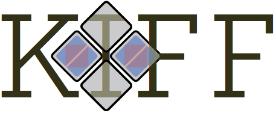
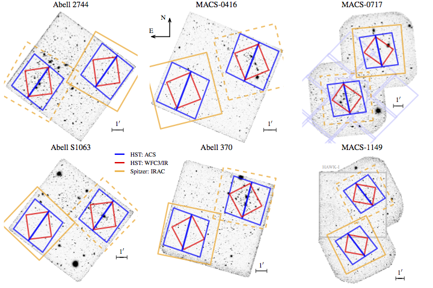
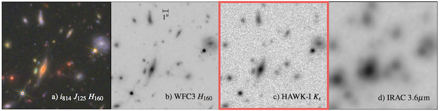
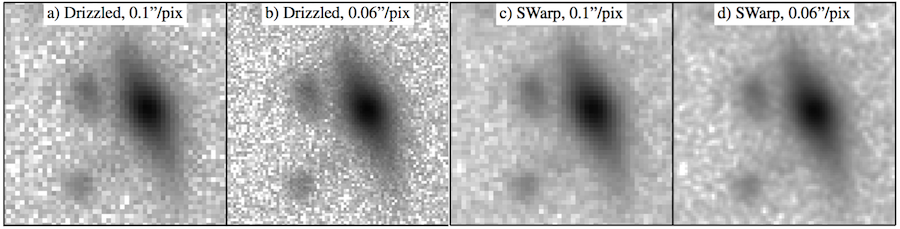

 

*K*s-band Imaging of the *Hubble* Frontier Fields
==================================================

We provide ultra-deep *K*s-band imaging of all six of the Hubble Frontier Fields clusters Abell 2744, MACS-0416, Abell S1063, Abell 370, MACS-0717 and MACS-1149.  

All of these fields have recently been observed with large allocations of Directors' Discretionary Time with the HST and Spitzer telescopes covering 0.4 < &lambda; < 1.6 &mu;m and 3.6–4.5 &mu;m, respectively. *VLT*/**HAWK-I** integrations of the first four fields reach 5&sigma; limiting depths of *K*s~26.0 (AB, point sources) and have excellent image quality (FWHM~0.4"). Shorter *Keck*/**MOSFIRE** integrations of the MACS-0717 (MACS-1149) field better observable in the north reach limiting depths *K*s=25.5 (25.1) with seeing FWHM~0.4" (0.5").  

The *K*s-band at 2.2 &mu;m crucially fills the gap between the reddest HST filter (1.6 &mu;m ~ *H* band) and the IRAC 3.6 &mu;m passband. While reaching the full depths of the space-based imaging is not currently feasible from the ground, the deep Ks-band images provide important constraints on both the redshifts and the stellar population properties of galaxies extending well below the characteristic stellar mass across most of the age of the universe, down to, and including, the redshifts of the targeted galaxy clusters (*z*~0.5). 

A full description of the observations, processing, and data quality are given by Brammer et al., ApJSS, submitted (manuscript and figures [here](Paper0/)).

Image mosaics
-------------
 

The HAWK-I field of view is perfectly suited (Abell 2744, MACS-0416, Abell S1063 and Abell 370) for simultaneous imaging of the *HST* cluster+parallel field pairs, which require two separate pointings with MOSFIRE (MACS-0717 and MACS-1149).  The total area of the Ks-band coverage is 490 arcmin2.

All 6 mosaics are provided below, along with inverse variance weight images.  The science images all have AB zeropoint ZP = 26.0 (mag = ZP - 2.5 log10 flux).

|Field   |Science            |Weight            |
|------- |------------------ |---------------   | 
| Abell 2744  |[KIFF_A2744_Ks_v1.0_sci.fits](http://www.stsci.edu/~brammer/HFF/Stack/KIFF_A2744_Ks_v1.0_sci.fits.gz) | 	[KIFF_M0416_Ks_v1.0_wht.fits](http://www.stsci.edu/~brammer/HFF/Stack/KIFF_M0416_Ks_v1.0_wht.fits.gz) | 
| MACS-0416   |[KIFF_M0416_Ks_v1.0_sci.fits](http://www.stsci.edu/~brammer/HFF/Stack/KIFF_M0416_Ks_v1.0_sci.fits.gz) | 	[KIFF_M0416_Ks_v1.0_wht.fits](http://www.stsci.edu/~brammer/HFF/Stack/KIFF_M0416_Ks_v1.0_wht.fits.gz) | 
| Abell S1063 |[KIFF_S1063_Ks_v1.0_sci.fits](http://www.stsci.edu/~brammer/HFF/Stack/KIFF_S1063_Ks_v1.0_sci.fits.gz) | 	[KIFF_S1063_Ks_v1.0_wht.fits](http://www.stsci.edu/~brammer/HFF/Stack/KIFF_S1063_Ks_v1.0_wht.fits.gz) | 
| Abell 370   |[KIFF_A370_Ks_v1.0_sci.fits](http://www.stsci.edu/~brammer/HFF/Stack/KIFF_A370_Ks_v1.0_sci.fits.gz) | 	[KIFF_A370_Ks_v1.0_wht.fits](http://www.stsci.edu/~brammer/HFF/Stack/KIFF_A370_Ks_v1.0_wht.fits.gz) | 
| MACS-0717   |[KIFF_M0717_Ks_v1.0_sci.fits](http://www.stsci.edu/~brammer/HFF/Stack/KIFF_M0717_Ks_v1.0_sci.fits.gz) | 	[KIFF_M0717_Ks_v1.0_wht.fits](http://www.stsci.edu/~brammer/HFF/Stack/KIFF_M0717_Ks_v1.0_wht.fits.gz) | 
| MACS-1149   |[KIFF_M1149_Ks_v1.0_sci.fits](http://www.stsci.edu/~brammer/HFF/Stack/KIFF_M1149_Ks_v1.0_sci.fits.gz) | 	[KIFF_M1149_Ks_v1.0_wht.fits](http://www.stsci.edu/~brammer/HFF/Stack/KIFF_M1149_Ks_v1.0_wht.fits.gz) | 

 

`Drizzle` image combination
---------------------------
 

A significant innovation developed for our analysis is the combination of all the individual raw exposures into the final mosaics using the `drizzle` algorithm.  With drizzle we can decrease the size of the input pixels before dropping them into the output pixel grid, which significantly reduces the correlations between neighboring pixels.  Combining images with simple shift-and-add resampling such as with SWarp results in an effective smoothing of the pixel-to-pixel noise in the final combined image. 

Another benefit of `drizzle` is straightforward compensation for geometric distortions of the HAWK-I detectors.  These distortions are relatively small for HAWK-I, but they are noticeable in the image corners in the high image-quality **KIFF** images.  Here we provide a version of the HAWK-I geometric distortion determined by [Libralato et al. (2014)](http://www.aanda.org/10.1051/0004-6361/201322059) translated into SIP header keywords that `drizzle` can recognize.  The SIP keywords were determined from a third-order polynomial fit to the full distortion images.  The headers can be found below, where note that we define the chips as in Libralato et al. with the chip numbers corresponding to the order of the extensions in the raw HAWKI image files provided by the ESO archive.  

|Chip #1   |Chip #2  |Chip #3   |Chip #4   |
|-------   |-------  |-------   |-------   |  
| [SIP header](Distortion/libralato_hawki_chip1.header)  | [SIP header](Distortion/libralato_hawki_chip2.header)  | [SIP header](Distortion/libralato_hawki_chip2.header)  | [SIP header](Distortion/libralato_hawki_chip3.header)  

The header ascii files can be read with, e.g., 

```python
>>> header = astropy.io.fits.Header.fromfile('libralato_hawki_chip1.header').
```

